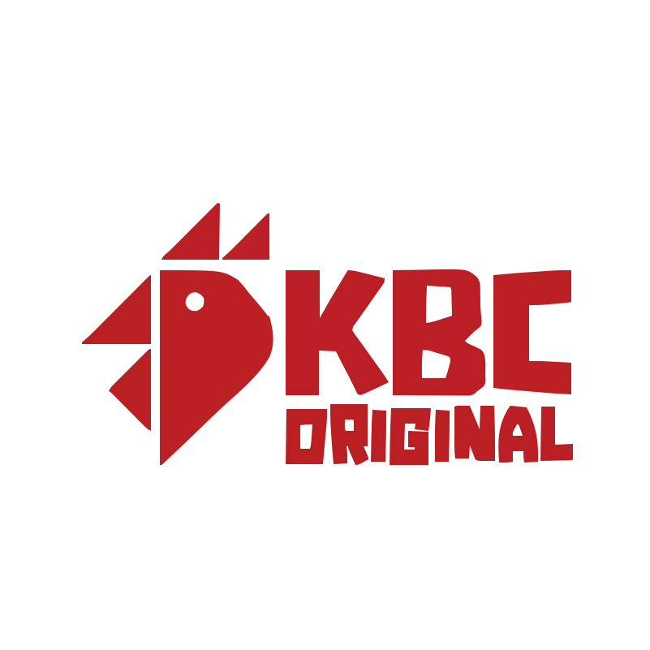

<p align="center">
  
</p>

<h1 align="center">KBC Original</h1>

<p align="center">
  <strong>Juicy. Smoky. Mouth-watering.</strong><br />
  Flame-grilled BBQ chicken — from Kinniya to Colombo and across Sri Lanka.
</p>

<p align="center">
  
  
  
  
</p>

---

## Overview

KBC Original is a premium brand showcase website for **Kinniya BBQ Chicken** — a Sri Lankan flame-grilled BBQ institution. The site highlights the menu, story, founders, gallery, reviews, and partner brand family. It is a showcase experience, not an e-commerce platform.

**Live development:** [http://localhost:3000](http://localhost:3000)

---

## Brand

| Token | Value | Usage |
|-------|-------|-------|
| `kbc-cream` | `#fff8f0` | Light section backgrounds |
| `kbc-orange` | `#f28c28` | Accents, CTAs, highlights |
| `kbc-orange-dark` | `#d97706` | Hover states |
| `kbc-charcoal` | `#1c1612` | Dark panels, footer, hero overlay |

**Display font:** Bebas Neue · **Body font:** Geist Sans

---

## Page Sections

| # | Section | ID | Description |
|---|---------|-----|-------------|
| 01 | Hero | `#hero` | Scroll-driven canvas animation, headline, menu CTA |
| 02 | Popular Menu | `#menu` | Horizontal dish carousel |
| 03 | About | `#about` | Story, outlet photo, brand marquee, journey timeline |
| 04 | Regular Menu | `#regular-menu` | Full menu with category tabs |
| 05 | Our Services | `#services` | Dine-in, takeaway, delivery, catering |
| 06 | Founders | `#founders` | Abdus Salaam & leadership story |
| 07 | Gallery | `#gallery` | Interactive photo spotlight |
| 08 | Reviews | `#reviews` | Featured review + flowing marquee |
| — | Footer | — | Brand wall, nav, newsletter, social links |

---

## Features

- **Scroll-driven hero** — 192-frame canvas animation tied to scroll position
- **Fixed site header** — Transparent over hero, solid charcoal bar when scrolled
- **Fullscreen mobile menu** — 8 numbered navigation links with scroll lock
- **Scroll reveal** — Subtle fade-up on each section (respects `prefers-reduced-motion`)
- **Brand marquees** — Partner logos in About and Footer (pause on hover)
- **Review flow** — Continuous single-row review marquee
- **Back to top** — Sticky orange button after leaving hero
- **Social links** — Instagram, LinkedIn, Google Maps with icons

---

## Responsive Design

The site is built mobile-first and tested across phone, tablet, and desktop breakpoints.

### Breakpoints

| Prefix | Min width | Typical use |
|--------|-----------|-------------|
| (default) | 0px | Mobile phones |
| `sm` | 640px | Large phones, small tablets |
| `md` | 768px | Tablets |
| `lg` | 1024px | Laptops, desktops |
| `xl` | 1280px | Wide screens |

### Mobile optimisations

- Fixed header with hamburger menu on all screen sizes
- Horizontal scroll carousels for dishes, categories, and journey tabs
- Gallery main image stacks above thumbnail grid
- Newsletter form stacks vertically on narrow screens
- Touch-friendly tap targets on service cards, belief cards, and founder stats
- Review cards scale to `min(100vw - 3rem, 360px)` on small phones
- `overflow-x: clip` on `html`/`body` prevents horizontal page scroll

### Tablet & desktop

- Multi-column grids for menu, services, footer nav, and gallery
- Belief cards switch to 3 columns at `md` (768px)
- Journey milestone tabs expand at `md`
- Fluid `clamp()` typography on major headings

### Accessibility

- `prefers-reduced-motion` disables scroll reveals, marquees, and hero bounce
- Semantic landmarks (`main`, `nav`, `footer`)
- `sr-only` labels on icon-only buttons
- Keyboard focus rings on interactive cards

---

## Project Structure

```
kbc/
├── app/
│   ├── layout.tsx          # Root layout, fonts, metadata
│   ├── page.tsx            # Home page composition
│   ├── globals.css         # Tailwind theme, animations
│   ├── icon.svg            # Cropped favicon
│   └── apple-icon.svg      # Apple touch icon
├── components/
│   ├── HeroSection.tsx     # Scroll canvas hero
│   ├── SiteHeader.tsx      # Fixed nav + menu overlay
│   ├── PopularDishes.tsx   # Dish carousel
│   ├── AboutSection.tsx    # About + beliefs
│   ├── OurJourneySection.tsx
│   ├── RegularDishes.tsx
│   ├── OurServices.tsx
│   ├── FoundersSection.tsx
│   ├── GallerySection.tsx
│   ├── ReviewsSection.tsx
│   ├── SiteFooter.tsx
│   ├── BackToTopButton.tsx
│   ├── ScrollReveal.tsx
│   └── KbcLogo.tsx
├── lib/
│   ├── dishes.ts           # Popular menu items
│   ├── regular-dishes.ts   # Full menu + categories
│   ├── reviews.ts          # Google reviews
│   ├── gallery.ts          # Gallery images
│   ├── other-brands.ts     # Partner brand logos
│   └── hero-frames.ts      # Hero animation frames
└── public/
    ├── Logo.svg
    ├── gallery/
    ├── hero-images/
    └── otherbrands/
```

---

## Getting Started

### Prerequisites

- Node.js 20+
- npm

### Install & run

```bash
npm install
npm run dev
```

Open [http://localhost:3000](http://localhost:3000).

### Build for production

```bash
npm run build
npm start
```

### Lint

```bash
npm run lint
```

---

## Social & Contact

| Platform | Link |
|----------|------|
| Instagram (KBC) | [@kbcoriginal](https://instagram.com/kbcoriginal) |
| Instagram (Founder) | [@ab_salaam](https://instagram.com/ab_salaam) |
| LinkedIn | [Abdus Salaam](https://www.linkedin.com/in/salaam/) |
| Location | [Bambalapitiya, Colombo](https://maps.google.com/?q=KBC+Original+Bambalapitiya) |

---

## Tagline

<p align="center">
  <em>BBQ is our way of life.</em><br />
  <strong>FLAME · GRILL · FLAVOUR</strong>
</p>

<p align="center">
  <sub>© KBC Original. All rights reserved.</sub>
</p>
